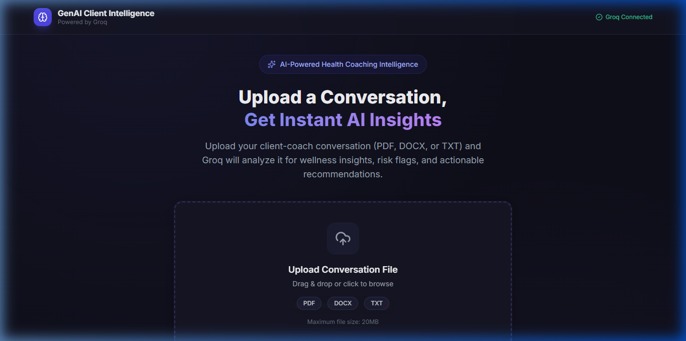
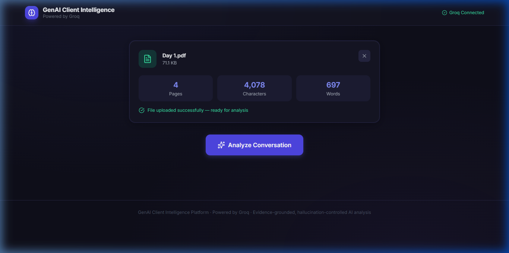
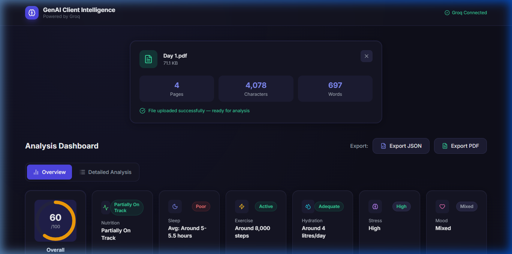
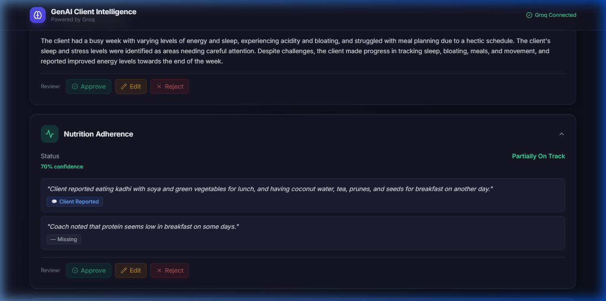
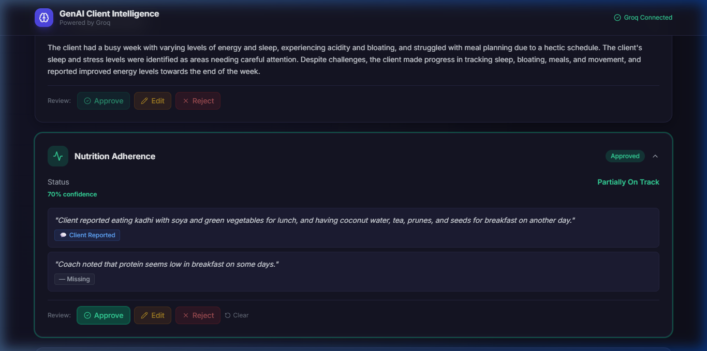
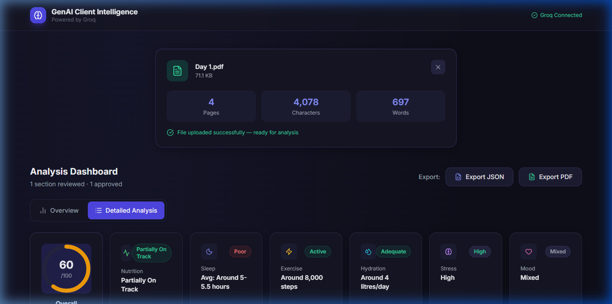

# GenAI Client Intelligence Platform - Unified Technical Manual

This document compiles, simplifies, and consolidates all platform documentation for the GenAI Client Intelligence Platform. It outlines the platform's architecture, data flows, deployment guidelines, API specifications, prompt engineering strategies, hallucination mitigation techniques, and development retrospectives.

---

## Table of Contents
1. [Platform Overview & System Architecture](#chapter-1-platform-overview--system-architecture)
2. [Setup & Installation Guide](#chapter-2-setup--installation-guide)
3. [API & Data Specifications](#chapter-3-api--data-specifications)
4. [Prompt Engineering & Hallucination Prevention](#chapter-4-prompt-engineering--hallucination-prevention)
5. [Engineering Retrospective & Project Compliance](#chapter-5-engineering-retrospective--project-compliance)
6. [Application Screenshots](#chapter-6-application-screenshots)
* [Appendix A: Complete System Prompt](#appendix-a-complete-system-prompt)
* [Appendix B: Example User Prompt](#appendix-b-example-user-prompt)
* [Appendix C: Example AI JSON Response](#appendix-c-example-ai-json-response)

---

## Chapter 1: Platform Overview & System Architecture

### 1.1 Project Purpose
In health coaching enterprises, coaches review massive volumes of daily client chat logs to track progress, note symptoms, and update coaching plans. Doing this manually is time-consuming, while standard AI text summarization is prone to **hallucinating data** (inventing numbers, guessing status values) or missing citation proof.

The **GenAI Client Intelligence Platform** is an enterprise-grade analytics prototype that automates transcript analysis. It extracts structured, evidence-grounded wellness insights from multi-day client-coach conversation logs while enforcing strict hallucination controls. Every metric returned is grounded with direct conversation quotes, confidence ratings, and data source classifications.

### 1.2 Technology Stack
The platform's features are powered by a decoupled client-server stack:
* **Frontend**: React 19, Vite, Tailwind CSS, Recharts (data visualization), and jsPDF (for local PDF generation).
* **Backend**: Python 3.10+, FastAPI (high-performance routing and Pydantic validation), and Uvicorn.
* **AI Orchestration**: Groq SDK running the `llama-3.3-70b-versatile` model.
* **Text Extraction**: `pdfplumber` (PDF parsing), `python-docx` (DOCX parsing), and native UTF-8 decoders (TXT files).

### 1.3 System Architecture
The application uses a three-tier model (Client UI, API Gateway, and LLM Inference Engine):

```
+-----------------------------------------------------------------------------------+
|                                  FRONTEND LAYER (React SPA)                       |
|  - Drag-and-Drop Ingestion UI                                                     |
|  - Recharts Dashboard (Radar/Bar charts)                                          |
|  - Human-in-the-Loop (HITL) Review Panel & PDF/JSON Export                        |
+---------------------------------------+-------------------------------------------+
                                        | HTTP POST /upload & /analyze
                                        v
+-----------------------------------------------------------------------------------+
|                                  BACKEND LAYER (FastAPI)                          |
|  - API Routing & CORS Middleware Configuration                                    |
|  - In-Memory Session Storage (UUID Map)                                           |
|  - File Ingestion & Text Extraction (pdfplumber, python-docx)                      |
|  - Groq Orchestration Service (System Prompt Construction & Response Parsing)     |
+---------------------------------------+-------------------------------------------+
                                        | Secure SDK Completion Request
                                        v
+-----------------------------------------------------------------------------------+
|                                 LLM INFERENCE LAYER                               |
|  - Groq Cloud API (llama-3.3-70b-versatile)                                       |
+-----------------------------------------------------------------------------------+
```

### 1.4 End-to-End Data Pipeline
The lifecycle of a transcript file proceeds through nine distinct stages:
1. **File Upload**: The user uploads a PDF, DOCX, or TXT transcript. The React UI captures transmission speed to display a progress bar. FastAPI limits payloads to 20MB.
2. **Text Extraction**: The backend detects the file extension. `pdfplumber` extracts raw text page-by-page (ignoring formatting), `python-docx` iterates through paragraph nodes, and TXT files are decoded directly as UTF-8.
3. **Session Ingress**: The extracted text is saved to an in-memory session database under a unique UUID. Document metadata (pages, word count, character count, and a text preview snippet) is sent to the frontend.
4. **Prompt Construction**: When the user requests analysis, the backend fetches the conversation text and combines it with a strict system prompt containing rules, schemas, and hallucination-grounding constraints.
5. **Groq Inference**: The compiled prompt is sent to the Groq Cloud endpoint. The model temperature is locked at `0.1` to force deterministic, accurate outputs.
6. **Response Sanitization**: The raw string response is cleaned using regular expressions to strip out potential markdown block markers (` ```json ... ``` `) and parsed into a native Python dictionary.
7. **Dashboard Render**: The frontend receives the JSON. It updates state to render a Radar Chart mapping wellness dimensions (0-100 scale), a Bar Chart showing score distribution, and detailed collapsible metric cards.
8. **Human-in-the-Loop Review**: The coach reviews the insights. They can approve or reject specific sections, edit status levels, or manually adjust symptom entries and recommendations.
9. **Final Export**: Clicking "Export PDF" compiles approved sections into a printable report using `jsPDF`. The raw post-review data can also be downloaded immediately as a JSON file.

---

## Chapter 2: Setup & Installation Guide

### 2.1 Prerequisites
* **Python**: Version 3.10 or higher.
* **Node.js**: Version 18 or higher.
* **Groq API Key**: A valid key obtained from the [Groq Console](https://console.groq.com/).

### 2.2 Local Deployment

#### 2.2.1 Backend Setup
1. Navigate to the backend directory:
   ```bash
   cd backend
   ```
2. Create and activate a Python virtual environment:
   ```bash
   python -m venv venv
   # On Windows (PowerShell):
   .\venv\Scripts\activate
   # On macOS/Linux:
   source venv/bin/activate
   ```
3. Install dependencies:
   ```bash
   pip install -r requirements.txt
   ```
4. Configure environment variables:
   Create a `.env` file in the `backend` folder:
   ```env
   GROQ_API_KEY=your_groq_api_key_here
   ```
5. Run the development server:
   ```bash
   python main.py
   ```
   The backend will run on **http://localhost:8000**. Swagger UI will be available at **http://localhost:8000/docs**.

#### 2.2.2 Frontend Setup
1. Open a new terminal and navigate to the frontend directory:
   ```bash
   cd frontend
   ```
2. Install npm dependencies:
   ```bash
   npm install
   ```
3. Start the Vite development server:
   ```bash
   npm run dev
   ```
   The frontend will run on **http://localhost:5173**. Open this URL in your web browser.

### 2.3 Production Cloud Deployment

#### 2.3.1 Backend Deployment (Render, Railway, EC2)
* **Build Command**: `pip install -r requirements.txt`
* **Start Command**: `uvicorn main:app --host 0.0.0.0 --port $PORT`
* **Environment Configuration**: Define the `GROQ_API_KEY` key/value in the hosting environment variables.
* **CORS Settings**: Update the allowed origins array in `backend/main.py` to point to the production frontend URL.

#### 2.3.2 Frontend Deployment (Vercel, Netlify)
* **Build Command**: `npm run build`
* **Output Directory**: `dist`
* **API Configuration**: Set `VITE_API_BASE_URL` to point to the deployed backend URL if hosting on a different domain.

---

## Chapter 3: API & Data Specifications

### 3.1 REST API Endpoints

#### 1. GET `/health`
Verifies that the backend service is running and that the Groq provider API key is loaded.
* **Response Payload (`HealthResponse`)**:
  ```json
  {
    "status": "ok",
    "groq_configured": true
  }
  ```

#### 2. POST `/upload`
Uploads a single transcript file, extracts the text, stores it in the session memory, and returns metadata.
* **Request Type**: `multipart/form-data`
* **Parameters**: `file` (Binary file. Allowed: `.pdf`, `.docx`, `.txt`. Max: 20MB).
* **Response Payload (`UploadResponse`)**:
  ```json
  {
    "session_id": "5f3a09b4-b4a1-432a-bc91-29e20a06fae2",
    "filename": "weekly_transcript.pdf",
    "pages": 1,
    "characters": 4075,
    "word_count": 697,
    "text_preview": "Coach: Welcome back to our session!..."
  }
  ```
* **Common Errors**:
  * `400 Bad Request`: Unsupported file type.
  * `413 Request Entity Too Large`: File exceeds 20MB limit.
  * `422 Unprocessable Entity`: File is empty or text extraction failed.

#### 3. POST `/analyze`
Triggers Groq API analysis for the specified session ID and returns structured wellness findings.
* **Request Type**: `application/json`
* **Payload**:
  ```json
  { "session_id": "5f3a09b4-b4a1-432a-bc91-29e20a06fae2" }
  ```
* **Response Payload**: Matches the structured wellness schema.
* **Common Errors**:
  * `404 Not Found`: Session ID does not exist in backend memory.
  * `503 Service Unavailable`: Groq API key is missing.
  * `422 Unprocessable Entity`: Failed to parse the response into valid JSON.

### 3.2 Structured JSON Schema
The Groq model outputs a JSON payload structured exactly as follows:

```json
{
  "weekly_summary": "2-3 sentence high-level overview of the client's progress.",
  "nutrition_adherence": {
    "status": "On Track | Off Track | Partially On Track | Not Mentioned",
    "confidence": 0.85,
    "evidence": [
      { "text": "Stuck to my diet on weekdays.", "source_type": "Client Reported" }
    ]
  },
  "exercise": {
    "status": "Active | Sedentary | Moderate | Not Mentioned",
    "steps": "8500 | Not Mentioned",
    "evidence": []
  },
  "sleep": {
    "status": "Good | Poor | Fair | Not Mentioned",
    "average": "7.5 | Not Mentioned",
    "evidence": []
  },
  "water_intake": {
    "status": "Adequate | Inadequate | Not Mentioned",
    "average": "2.5 | Not Mentioned",
    "evidence": []
  },
  "symptoms": [
    {
      "symptom": "Headache",
      "frequency": "Daily",
      "severity": "mild | moderate | severe | Not Mentioned",
      "source_type": "Client Reported",
      "evidence": "Had a mild headache every afternoon."
    }
  ],
  "stress": {
    "level": "Low | Moderate | High | Not Mentioned",
    "evidence": []
  },
  "mood": {
    "overall": "Positive | Neutral | Negative | Mixed | Not Mentioned",
    "evidence": []
  },
  "engagement": {
    "level": "High | Medium | Low | Not Mentioned",
    "reason": "Client responds quickly to weekly prompts."
  },
  "key_barriers": [
    { "barrier": "Work travel", "source_type": "Client Reported", "evidence": "Traveling on business" }
  ],
  "pending_actions": [
    { "action": "Increase water intake", "owner": "Client", "priority": "High" }
  ],
  "risk_flags": [
    { "flag": "High stress levels affecting sleep", "severity": "Medium", "source_type": "AI Inference", "evidence": "Stress at work is keeping me up at night" }
  ],
  "coach_recommendations": [
    { "recommendation": "Add a short walk at lunch.", "priority": "Medium", "rationale": "Helps meet steps goal" }
  ],
  "missing_information": [
    "No details were provided about caffeine consumption."
  ],
  "overall_wellness_score": "75/100",
  "confidence": "0.9"
}
```

---

## Chapter 4: Prompt Engineering & Hallucination Prevention

### 4.1 Prompt Strategy
The system prompt in `backend/services/groq.py` guides the model to act as a structured compiler of facts rather than a conversational engine:
1. **Explicit Role Assignment**: Establishes the persona of an "expert health coaching intelligence analyst" to promote clinical-style observation.
2. **Deterministic Schema**: Outlines a strict JSON template to prevent the model from altering keys, omitting blocks, or returning freeform explanations.
3. **Markdown Code-Fence Suppression**: Explicitly requests raw JSON to minimize parsing failures.

### 4.2 Hallucination Prevention Controls
* **The "Not Mentioned" Rule**: To prevent the model from guessing missing details, it must set empty values to `"Not Mentioned"` and empty arrays to `[]`.
* **Evidence Grounding**: Every category requires supporting text strings matching quotes or paraphrases from the transcript.
* **Confidence Rating**: The model scores its confidence on a scale of `0.0` (missing/not mentioned) to `1.0` (validated by biometric devices or explicit claims).
* **Source Classification**: Citations are tagged with a source type to indicate credibility:
  * `Confirmed Fact`: Verified by biometric devices or specific records.
  * `Client Reported`: Subjective self-reporting by the client.
  * `AI Inference`: Extrapolations made by the model based on logical context.
  * `Missing Information`: Identifies critical tracking gaps.

### 4.3 Safety Mitigation Scenarios

#### Scenario 1: Unmentioned Metric Fabrication (Water Intake)
* *Input*: Client discusses sleep (7 hours) and workouts, but never mentions water.
* *Incorrect AI Behavior*: Guessing a healthy volume (e.g. "2.0 liters") based on exercise.
* *System Prevention*: Prompt mandates `"Not Mentioned"` status if water is absent, leaving the average as `"Not Mentioned"` and evidence as `[]`.

#### Scenario 2: Numerical Extrapolation & Guessing (Exercise Steps)
* *Input*: Client says: *"I went for a 30-minute jog on Wednesday, and walked to the office twice."*
* *Incorrect AI Behavior*: Guessing a specific step count (e.g. "10,000 steps").
* *System Prevention*: Model separates active status (`Active`) from numerical metrics, setting steps to `"Not Mentioned"` while quoting the jog as evidence.

#### Scenario 3: Subjective Claim vs. Device-Validated Fact (Sleep Quality)
* *Input*: Client says: *"I feel extremely tired today, but my sleep tracker actually showed 8 hours of sleep. I think my quality was just poor."*
* *Incorrect AI Behavior*: Setting status to `Good` based solely on the 8 hours tracker reading.
* *System Prevention*: Schema captures duration (`8` hours) and subjective sleep quality (`Poor`) separately, associating each with its respective classification tag (`Confirmed Fact` vs. `Client Reported`).
### 4.4 Original Platform Specifications & Prompt Guidelines

The design, prompt constraints, and validation schemas implemented within the platform are guided by the original system prompt specifications below:

> **Role & Mission**
> * You are a Senior Full Stack AI Engineer, GenAI Architect, Prompt Engineer, and Product Designer.
> * Your task is to build a COMPLETE WORKING APPLICATION for a "GenAI Client Intelligence Platform" (rejecting UI mockups or static dashboards).
>
> **Stack Requirements**
> * **Frontend**: React + Vite + Tailwind CSS
> * **Backend**: Python FastAPI (calling Groq API; frontend must NEVER call Groq directly)
> * **LLM Engine**: Groq API (Key stored securely inside a `.env` file)
>
> **Absolute Ingestion & Analysis Rules**
> * No sample data, hardcoded JSON, fake reports, or simulated AI responses.
> * Document upload supports PDF, DOCX, and TXT (up to 20MB) with upload progress indicators.
> * Displays metadata (filename, pages, characters, word count) before initiating analysis.
>
> **Grounded JSON Schema**
> The model is instructed to output ONLY a valid JSON dictionary conforming to the structured schema containing: `weekly_summary`, `nutrition_adherence`, `exercise` (with `steps`), `sleep`, `water_intake`, `symptoms`, `stress`, `engagement`, `key_barriers`, `pending_actions`, `risk_flags`, `coach_recommendations`, `missing_information`, and `overall_wellness_score`.
>
> **Hallucination Mitigation & Evidence Tagging**
> * Every finding MUST contain `evidence` (direct quotes), a `confidence` rating, and a `source_type` (`Confirmed Fact`, `Client Reported`, `AI Inference`, or `Missing Information`).
> * If information is unavailable, the model must return `"Not Mentioned"` (no inventing data, guessing step counts, or simulating meals).
>
> **Human-in-the-Loop & Export Flow**
> * Every section must be reviewable (Approve, Edit, Reject).
> * The reviewed dashboard report must support export to both JSON and PDF.

---

## Chapter 5: Engineering Retrospective & Project Compliance

### 5.1 Design Decisions
* **FastAPI Backend**: Chosen for native Pydantic support, automatic Swagger documentation generation, and high concurrency.
* **Glassmorphism Dark Theme**: Dark UI with glowing indicators provides a premium feel matching modern developer-centric tools.
* **In-Memory Storage**: Keeps local setup database-free for simplicity and speed.

### 5.2 Key Challenges & Resolutions
1. **HTTPX & Groq Client Collision**:
   * *Problem*: The application crashed on startup with `TypeError: Client.__init__() got an unexpected keyword argument 'proxies'`.
   * *Cause*: `httpx` version `0.28.1` removed the deprecated `proxies` argument, but the older `groq` SDK package (v0.9.0) still passed it internally.
   * *Resolution*: Downgraded `httpx` in the requirements list to `<0.28.0` (version `0.27.2`), restoring the `proxies` parameter and stabilizing Uvicorn.
2. **LLM Output Formatting Deviations**:
   * *Problem*: Occasional markdown code blocks (` ```json ... ``` `) in LLM responses crashed JSON parsing.
   * *Resolution*: Implemented regex filters in `backend/services/groq.py` that strip block markers before running `json.loads`.

### 5.3 Assignment Requirement Mapping Table

The following matrix documents every core functional and design requirement outlined in the internship prompt, along with its current implementation status:

| Assignment Requirement | Status | Implementation Details |
| :--- | :--- | :--- |
| **Weekly Summary** | Completed | Included as `weekly_summary` in the JSON schema and rendered at the top of the dashboard. |
| **Nutrition** | Completed | Categorized with status and evidence array in the schema; shown in nutrition card. |
| **Exercise** | Completed | Extracts active/sedentary status and step counts; plotted in activity card. |
| **Sleep** | Completed | Extracts average hours and subjective quality; rendered in sleep analytics card. |
| **Water Intake** | Completed | Tracks daily water average in liters; displayed in hydration card. |
| **Symptoms** | Completed | Dynamic symptom list extracted with frequency, severity, and verbatim quotes. |
| **Stress** | Completed | Detects stress level (Low/Moderate/High) and logs matching evidence quotes. |
| **Engagement** | Completed | Analyzes overall client compliance level and the qualitative reasoning. |
| **Key Barriers** | Completed | Lists client struggles (e.g. travel, scheduling) with cited conversation quotes. |
| **Pending Actions** | Completed | Generates action items showing the assigned owner (Client/Coach) and priority level. |
| **Risk Flags** | Completed | Flags potential health hazards or anomalies with severity and evidence quotes. |
| **Coach Recommendation** | Completed | Suggests actions for coaches with priority levels and direct reasoning. |
| **Supporting Evidence** | Completed | Captures verbatim quotes from the transcripts for every category's findings. |
| **Human Review** | Completed | Enables coaches to Approve, Edit, or Reject metrics, edit fields, and remove rows. |
| **Confirmed Facts** | Completed | Source classification tag for device-tracked metrics (e.g., smart scale/watch). |
| **Client Reported** | Completed | Source classification tag for subjective comments made by the client. |
| **AI Inference** | Completed | Source classification tag for logical inferences deduced by the Groq model. |
| **Missing Information** | Completed | Lists tracking gaps and categories not discussed in the transcript. |
| **Upload Conversation** | Completed | Supports single-file ingestion with interactive drag-and-drop area. |
| **PDF Upload** | Completed | Uses `pdfplumber` backend service to parse and extract text from PDFs. |
| **DOCX Upload** | Completed | Uses `python-docx` backend service to iterate paragraphs in DOCX files. |
| **TXT Upload** | Completed | Decodes raw text transcripts directly using UTF-8 standard. |
| **Backend** | Completed | Written in Python FastAPI, with structured endpoints and Pydantic validation. |
| **Groq Integration** | Completed | Back-end service calling `llama-3.3-70b-versatile` with low temperature (0.1). |
| **JSON Output** | Completed | Model output is sanitized via regex and parsed strictly into standard JSON. |
| **Export PDF** | Completed | Frontend triggers local report generation using standard client-side `jsPDF`. |
| **Export JSON** | Completed | Downloads a validated JSON file containing current (post-review) dashboard state. |

---

### 5.4 Short Project Note

#### What I Built
I built a complete, decoupled web application composed of a FastAPI Python backend and a React/Vite/Tailwind CSS frontend that automatically analyzes wellness transcripts. The backend extracts text from PDF, DOCX, and TXT files, and passes it to Groq's `llama-3.3-70b-versatile` model. The model generates a structured wellness report grounded with direct quotes and confidence ratings. The frontend renders this JSON inside a modern dark-themed dashboard, offering a Human-in-the-Loop review system (to Approve, Edit, or Reject specific metrics) and allowing exports to PDF and JSON.

#### Key Assumptions
1. **API Keys**: We assume a valid `GROQ_API_KEY` is configured in the environment (`.env`) for backend orchestration.
2. **Context Limits**: We assume transcripts do not exceed the Groq model's token limits (8192 tokens for completions; 128k context window), which is sufficient for standard weekly coaching transcripts.
3. **Format Schema**: We assume the client-coach log follows a readable dialog pattern (e.g. `Coach: ... \n Client: ...`) to enable clear evidence citations.
4. **Session Lifetime**: Uploaded transcripts are stored in-memory in the backend. Sessions are cleared upon server restart, keeping deployment simple and lightweight without DB overhead.

#### What Could Go Wrong
1. **Network Connectivity & Latency**: API requests to the Groq endpoints could fail, time out, or experience high latency under load, affecting user experience.
2. **JSON Structural Alterations**: Although temperature is set to `0.1`, LLMs can occasionally output slightly invalid JSON format (e.g., trailing commas or unexpected markdown fences), which would break the parsing step.
3. **Complex Layout Extraction**: PDF documents with highly complex formats (e.g., multi-column text, nested charts, image overlays) might be parsed in the wrong reading order by standard text extractors, confusing the context window.

#### Future Improvements
1. **Persistent Session Storage**: Integrate a relational or document database (like SQLite or PostgreSQL) to persist uploaded history and coach edits.
2. **Batch Processing**: Allow multiple files to be uploaded and analyzed simultaneously, merging findings across weeks.
3. **Enhanced PDF Parsing**: Implement Optical Character Recognition (OCR) using `Tesseract` or advanced LLM-based layout parsers to handle scanned images or complex layouts.
4. **Fine-Tuning/RAG**: Embed a vector database to search historic recommendations, providing the LLM with context on past coaching sessions to make suggestions more personalized.

---

## Chapter 6: Application Screenshots

This chapter presents mockups/placeholders and functional descriptions of the key interface screens of the GenAI Client Intelligence Platform.

### 6.1 Home Page
The Home Page serves as the central landing page. It outlines the platform's features, displays the current API connection health status, and welcomes coaches to the workspace.

<div style="text-align: center; margin-top: 10px; margin-bottom: 15px;">
    
</div>

### 6.2 Upload Conversation Screen
This interface features an interactive, drag-and-drop zone that supports PDF, DOCX, and TXT files up to 20MB. It displays upload progress in real-time and, once completed, summarizes the parsed metadata (filename, page count, character count, and word count) along with an "Analyze Conversation" action trigger.

<div style="text-align: center; margin-top: 10px; margin-bottom: 15px;">
    
</div>

### 6.3 Dashboard
A modern, dark-themed dashboard that renders overall wellness scores using interactive charts. It splits wellness metrics into clean category cards (Nutrition, Sleep, Activity, Hydration, Stress, Symptoms) featuring progress bars and risk badges.

<div style="text-align: center; margin-top: 10px; margin-bottom: 15px;">
    
</div>

### 6.4 Evidence Panel
Located inside each metric card, this collapsible panel displays grounding evidence quoted directly from the transcripts, mapped with a confidence rating (0.0 to 1.0) and source type indicator badges.

<div style="text-align: center; margin-top: 10px; margin-bottom: 15px;">
    
</div>

### 6.5 Human Review Panel
An interactive tool that enables coaches to review AI deductions. The coach can select to "Approve", "Edit", or "Reject" any specific card or metric, edit the value fields manually, and update recommended actions.

<div style="text-align: center; margin-top: 10px; margin-bottom: 15px;">
    
</div>

### 6.6 Export PDF
Generates a printable client wellness report compiling only approved sections, formatting it into a professional layout complete with headers, footers, and structural boundaries.

<div style="text-align: center; margin-top: 10px; margin-bottom: 15px;">
    
</div>

---

## Appendices

### Appendix A: Complete System Prompt
The system prompt used to guide the Groq model during analysis:

```
You are an expert health coaching intelligence analyst. Your task is to carefully analyze a client-coach conversation and produce a structured JSON report.

STRICT RULES:
1. NEVER invent, estimate, or hallucinate information not explicitly in the conversation.
2. If a metric is not mentioned, set its value to "Not Mentioned".
3. Every insight MUST include direct evidence quoted or paraphrased from the conversation.
4. Every finding MUST include a source_type: one of ["Confirmed Fact", "Client Reported", "AI Inference", "Missing Information"].
5. Confidence scores must be between 0.0 and 1.0. Only set high confidence for explicitly stated facts.
6. The overall_wellness_score should be a string like "72/100" based only on what is explicitly mentioned.
7. Return ONLY valid JSON — no markdown, no explanation, no code fences.

ANALYSIS SCOPE: Analyze ONLY what is explicitly mentioned in the conversation. Do not fill gaps with assumptions.

Produce the following JSON structure exactly:

{
  "weekly_summary": "<2-3 sentence summary of the week based only on the conversation>",
  "nutrition_adherence": {
    "status": "<On Track | Off Track | Partially On Track | Not Mentioned>",
    "confidence": "<0.0-1.0>",
    "evidence": [
      {
        "text": "<direct evidence from conversation>",
        "source_type": "<Confirmed Fact | Client Reported | AI Inference | Missing Information>"
      }
    ]
  },
  "exercise": {
    "status": "<Active | Sedentary | Moderate | Not Mentioned>",
    "steps": "<number or 'Not Mentioned'>",
    "evidence": [
      {
        "text": "<direct evidence from conversation>",
        "source_type": "<Confirmed Fact | Client Reported | AI Inference | Missing Information>"
      }
    ]
  },
  "sleep": {
    "status": "<Good | Poor | Fair | Not Mentioned>",
    "average": "<hours per night or 'Not Mentioned'>",
    "evidence": [
      {
        "text": "<direct evidence from conversation>",
        "source_type": "<Confirmed Fact | Client Reported | AI Inference | Missing Information>"
      }
    ]
  },
  "water_intake": {
    "status": "<Adequate | Inadequate | Not Mentioned>",
    "average": "<liters/day or 'Not Mentioned'>",
    "evidence": [
      {
        "text": "<direct evidence from conversation>",
        "source_type": "<Confirmed Fact | Client Reported | AI Inference | Missing Information>"
      }
    ]
  },
  "symptoms": [
    {
      "symptom": "<symptom name>",
      "frequency": "<frequency or 'Not Mentioned'>",
      "severity": "<mild | moderate | severe | Not Mentioned>",
      "source_type": "<Confirmed Fact | Client Reported | AI Inference | Missing Information>",
      "evidence": "<direct quote or paraphrase>"
    }
  ],
  "stress": {
    "level": "<Low | Moderate | High | Not Mentioned>",
    "evidence": [
      {
        "text": "<direct evidence from conversation>",
        "source_type": "<Confirmed Fact | Client Reported | AI Inference | Missing Information>"
      }
    ]
  },
  "mood": {
    "overall": "<Positive | Neutral | Negative | Mixed | Not Mentioned>",
    "evidence": [
      {
        "text": "<direct evidence from conversation>",
        "source_type": "<Confirmed Fact | Client Reported | AI Inference | Missing Information>"
      }
    ]
  },
  "engagement": {
    "level": "<High | Medium | Low | Not Mentioned>",
    "reason": "<brief explanation based on conversation>"
  },
  "key_barriers": [
    {
      "barrier": "<barrier description>",
      "source_type": "<Confirmed Fact | Client Reported | AI Inference | Missing Information>",
      "evidence": "<direct quote or paraphrase>"
    }
  ],
  "pending_actions": [
    {
      "action": "<action item>",
      "owner": "<Client | Coach | Both>",
      "priority": "<High | Medium | Low>"
    }
  ],
  "risk_flags": [
    {
      "flag": "<risk description>",
      "severity": "<High | Medium | Low>",
      "source_type": "<Confirmed Fact | Client Reported | AI Inference | Missing Information>",
      "evidence": "<direct quote or paraphrase>"
    }
  ],
  "coach_recommendations": [
    {
      "recommendation": "<recommendation text>",
      "priority": "<High | Medium | Low>",
      "rationale": "<why this is recommended, based only on conversation evidence>"
    }
  ],
  "missing_information": [
    "<description of health-relevant topic not discussed in the conversation>"
  ],
  "overall_wellness_score": "<score/100 based only on available data>",
  "confidence": "<0.0-1.0 overall confidence in analysis>"
}
```

### Appendix B: Example User Prompt
The structured prompt template submitted by the backend containing the extracted text:

```
Analyze the following client-coach conversation and return ONLY the JSON analysis. Do not include any markdown, code blocks, or explanations — return raw JSON only.

CONVERSATION:
---
Coach: Hi Sarah, how did your week go with the nutrition plan?
Client: Hi coach! Honestly, it was pretty good. I stuck to the meals we planned on weekdays, but Saturday I went out for dinner and had some pizza.
Coach: That's completely fine, Sarah. How was your sleep and water intake?
Client: Sleep tracker says I got an average of 7 hours of sleep per night. I felt rested. For water, I was drinking about 3 bottles (around 1.5 liters) every day.
Coach: Good job. Did you get any exercise in?
Client: Yes, I went to the gym twice. I did some strength training, but my step tracker was broken so I don't know my exact steps.
Coach: Got it. Any issues or symptoms?
Client: I had a mild headache on Tuesday afternoon, but it went away after I rested.
---
```

### Appendix C: Example AI JSON Response
A sample compliant JSON payload returned by the model:

```json
{
  "weekly_summary": "The client had a productive week, adhering to the nutrition plan during weekdays with a minor deviation on Saturday. Sleep was self-reported and device-tracked at an average of 7 hours, and exercise included two gym sessions, though steps were not recorded.",
  "nutrition_adherence": {
    "status": "Partially On Track",
    "confidence": "0.90",
    "evidence": [
      {
        "text": "stuck to the meals we planned on weekdays, but Saturday I went out for dinner and had some pizza",
        "source_type": "Client Reported"
      }
    ]
  },
  "exercise": {
    "status": "Active",
    "steps": "Not Mentioned",
    "evidence": [
      {
        "text": "went to the gym twice. I did some strength training",
        "source_type": "Client Reported"
      },
      {
        "text": "step tracker was broken so I don't know my exact steps",
        "source_type": "Missing Information"
      }
    ]
  },
  "sleep": {
    "status": "Good",
    "average": "7",
    "evidence": [
      {
        "text": "Sleep tracker says I got an average of 7 hours of sleep per night. I felt rested.",
        "source_type": "Confirmed Fact"
      }
    ]
  },
  "water_intake": {
    "status": "Inadequate",
    "average": "1.5",
    "evidence": [
      {
        "text": "drinking about 3 bottles (around 1.5 liters) every day",
        "source_type": "Client Reported"
      }
    ]
  },
  "symptoms": [
    {
      "symptom": "Headache",
      "frequency": "Once",
      "severity": "mild",
      "source_type": "Client Reported",
      "evidence": "had a mild headache on Tuesday afternoon"
    }
  ],
  "stress": {
    "level": "Low",
    "evidence": [
      {
        "text": "I felt rested",
        "source_type": "Client Reported"
      }
    ]
  },
  "mood": {
    "overall": "Positive",
    "evidence": [
      {
        "text": "Honestly, it was pretty good",
        "source_type": "Client Reported"
      }
    ]
  },
  "engagement": {
    "level": "High",
    "reason": "Client actively shares biometric data and details minor deviations transparently."
  },
  "key_barriers": [
    {
      "barrier": "Dining out on weekends",
      "source_type": "Client Reported",
      "evidence": "Saturday I went out for dinner and had some pizza"
    }
  ],
  "pending_actions": [
    {
      "action": "Fix or replace the broken step tracker",
      "owner": "Client",
      "priority": "Medium"
    },
    {
      "action": "Increase daily water intake to 2-3 liters",
      "owner": "Client",
      "priority": "High"
    }
  ],
  "risk_flags": [],
  "coach_recommendations": [
    {
      "recommendation": "Try to plan a balanced meal choice when dining out on weekends to maintain adherence.",
      "priority": "Medium",
      "rationale": "Addressed Saturday pizza meal choice."
    }
  ],
  "missing_information": [
    "No details were provided about stress levels directly, or about caffeine/alcohol intake."
  ],
  "overall_wellness_score": "78/100",
  "confidence": "0.95"
}
```


